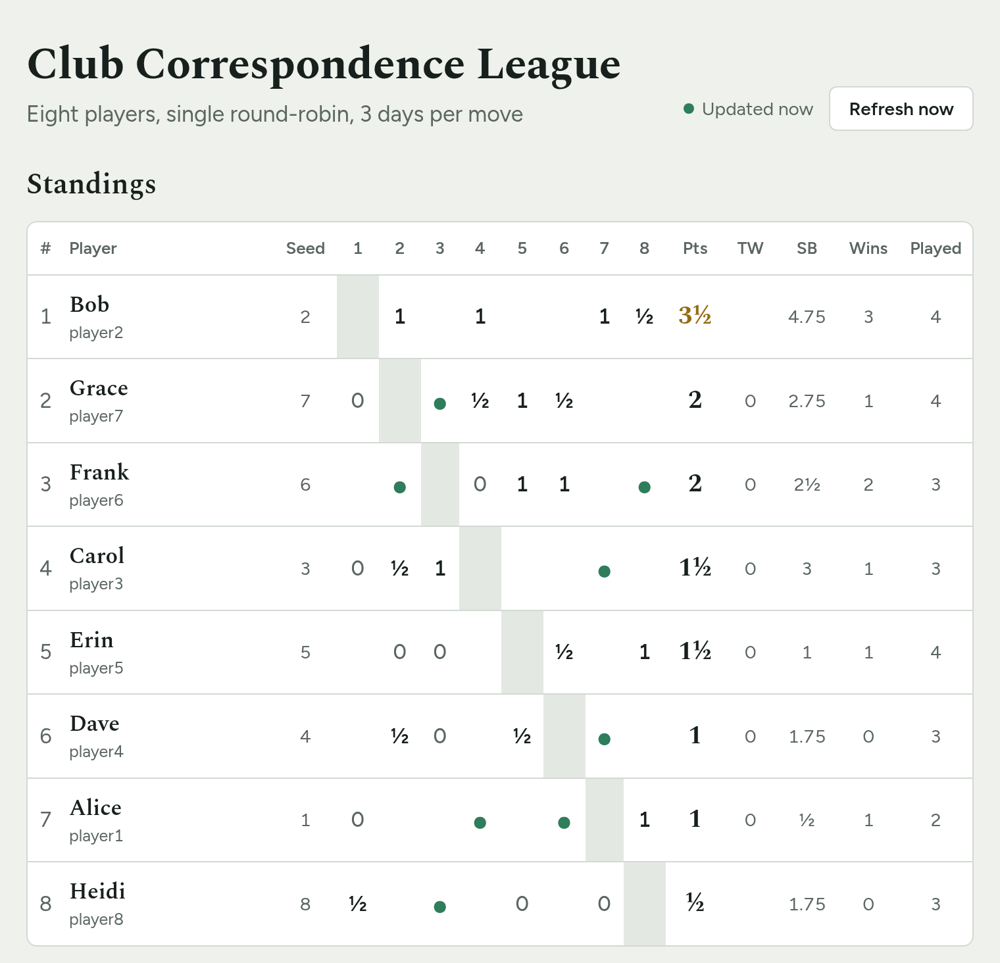
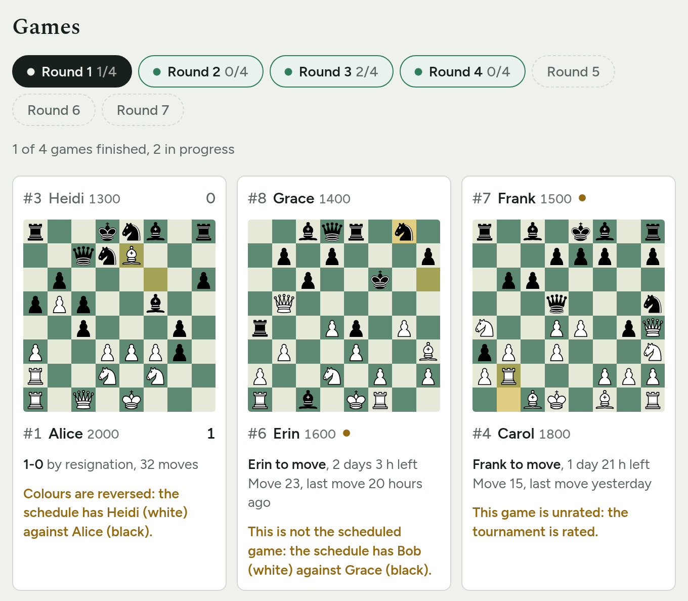

# lichess-league

Lichess runs arenas and Swiss events, but not tournaments whose games the
players set up themselves: correspondence games, or a slow league where
opponents agree when to play each round. This page follows such a tournament
from a list of Lichess game IDs.

It's a single page that you put on any static host. There is no server, no
database and no account to create. For now it handles round-robin
tournaments.

To see it with made-up games, open the
[demo](https://csaavedra.github.io/lichess-league/).

## What the page shows

- A crosstable with points, tiebreaks and games played. A green dot marks a
  game in progress.
- Each round's games, with a board per game, the result or whose move it
  is, and the time left to move, highlighted when it's under a day.
- A move-by-move view of each game.
- Each player's tournament: their games, performance, score against
  expectation and, in a rated tournament, the rating they gained or lost.
- For each game not started yet, a link for White to send the challenge.

Game data comes from Lichess and the page refreshes it every few minutes,
so it can stay open on a screen.

There is no engine or evaluation anywhere on the page, on purpose: games
may still be in progress.

Players can also create their challenges by hand, and mistakes happen, so
the page checks every game against the schedule and warns when:

- the colours are reversed, or the players aren't the scheduled ones;
- the game is unrated in a rated tournament, or the other way round;
- the time control isn't the tournament's;
- a game ID is wrong, or includes a player's private token (see below);
- a player in the schedule is missing from the player list.

## Running a tournament

1. Decide the players and the pairings. The page doesn't make pairings:
   you bring the schedule. For a round-robin, the standard Berger tables
   are a good choice, and sites like Challonge can generate them.
2. Write them in `tournament.json`, starting from `tournament.example.json`
   (described below).
3. Put the page online (see [Publishing](#publishing)) and share the link
   with the players.
4. When a round starts, White sends the challenge from the link next to
   their game. It comes with the right opponent, colours, time control and
   rating already set.
5. Once a game starts, add its ID to `tournament.json`. From then on the
   page follows the game on its own, until it's over.

The page re-reads `tournament.json` on every refresh, so editing that file
is all it takes to keep the tournament up to date.

> **Only ever paste the first 8 characters of a game ID.** A player who
> copies the link from their own game gets a 12-character URL; the last 4
> characters are a private token that lets anyone move for them. The page
> warns about such IDs.

## The tournament file

`tournament.json` holds everything about the tournament:

- `title`: shown in the header.
- `subtitle`: shown under the title. Without it, the page builds one from
  the settings and the games, like "Rated · round-robin · 3 days per move ·
  since October 1st, 2026". The dates run from the first game created to
  the last game ended, or say "upcoming" before any game exists. Use `""`
  for no subtitle.
- `players`: each player's Lichess `username`, display `name`, `seed`, and a
  `seedRating` (with `seedBasis`, the rating it came from). Seed ratings are
  used for expected score and performance.
- `rounds`: each round has a `name` and its `games`, as
  `{ "white": username, "black": username, "id": "" }`. Leave `id` empty
  until the game exists; then put in its 8-character ID, or its link, like
  `https://lichess.org/AbCd1234`.
- `rated`: whether the games should be rated on Lichess (default `true`).
- `timeControl`: the time control the games should have, either
  `{ "days": 3 }` (days per move) or `{ "minutes": 90, "increment": 30 }`
  (a clock, with the increment in seconds). It has to be one Lichess's
  challenge form offers: 1, 2, 3, 5, 7, 10 or 14 days, or one of its
  clocks. Without it, any time control is accepted, and players pick one
  when they send the challenge.
- `format`: how the tournament is played. Only `"round-robin"`, the
  default, is supported for now.
- `scoring`: points for a win, draw and loss (default 1, ½, 0).
- `refreshSeconds`: how often to check Lichess for updates, in seconds
  (default 300, at least 20, at most a day).

## Standings

Ties on points are broken, in order, by:

1. TW: wins against the other players on the same points (draws don't count)
2. Sonneborn–Berger
3. Total wins
4. Seed

Performance uses Lichess's tournament formula: the average of each
opponent's seed rating, +500 for a win and −500 for a loss. Seed ratings
are used instead of current Lichess ratings because those change from game
to game.

## For players

- Your games are listed by round. When it's your turn to play White, use the
  link next to your game to send the challenge. Don't change anything on
  the form: Lichess won't send it if the time control, rating or colour
  is changed.
- If you play Black, wait for your opponent's challenge.
- When you send your game to the organizer, send only the first 8
  characters of its ID. The link you see while playing has 4 more that let
  anyone move for you.

## Publishing

The page reads `tournament.json` next to it, so it has to be served over
HTTP; opening the file directly won't work. To try it on your computer:

    cp tournament.example.json tournament.json
    python3 -m http.server --bind localhost 8000

Then open http://localhost:8000/tournament.html.

To put it online, copy `tournament.html` (renamed to `index.html` if you
like), `lib.js`, `lichess.js`, the `vendor/` folder and `tournament.json` to
any static host. On GitHub Pages, put those in a repository and turn on Pages
in its settings.
After that, updating the tournament means editing `tournament.json` there.

## Trying it without real games

`demo/` has made-up tournaments, to see how the page looks before you have
real games:

    python3 demo/serve.py

Then open http://localhost:8000/demo/ and pick one:

- `halfway`: finished, live and upcoming rounds.
- `finished`: every game played, with ties in the standings.
- `problems`: one game for each warning the page shows.
- `unrated`: an unrated tournament with two rated games.

Nothing is sent to Lichess. The same tournaments are
[online](https://csaavedra.github.io/lichess-league/), built from the
latest version of the page.

## Changing the look

Colours and fonts can be changed with a `theme/theme.css` file next to the
page, and there's room in the header for a logo. See
[HACKING.md](HACKING.md#theming) for details.

`themes/lichess` follows the look of [Lichess](https://lichess.org), in
light and dark. The `finished` demo uses it. To use it, copy that folder next
to the page as `theme/`, or try it on all the demos with
`python3 demo/serve.py --theme themes/lichess`.

## License

MIT. See [LICENSE](LICENSE).

The page comes with a copy of, in `vendor/` with its license:

- [chess.js](https://github.com/jhlywa/chess.js) by Jeff Hlywa, BSD-2-Clause.

And it loads, without bundling them:

- The cburnett pieces by Colin M.L. Burnett, GPLv2+, from Lichess.
- The chess font that draws the pieces in the moves, by the pgn4web authors,
  GPLv2+, from Lichess.
- The Figtree and Spectral fonts, SIL Open Font License, from Google Fonts.

This project is not affiliated with Lichess. Game data comes from the
[Lichess API](https://lichess.org/api).
